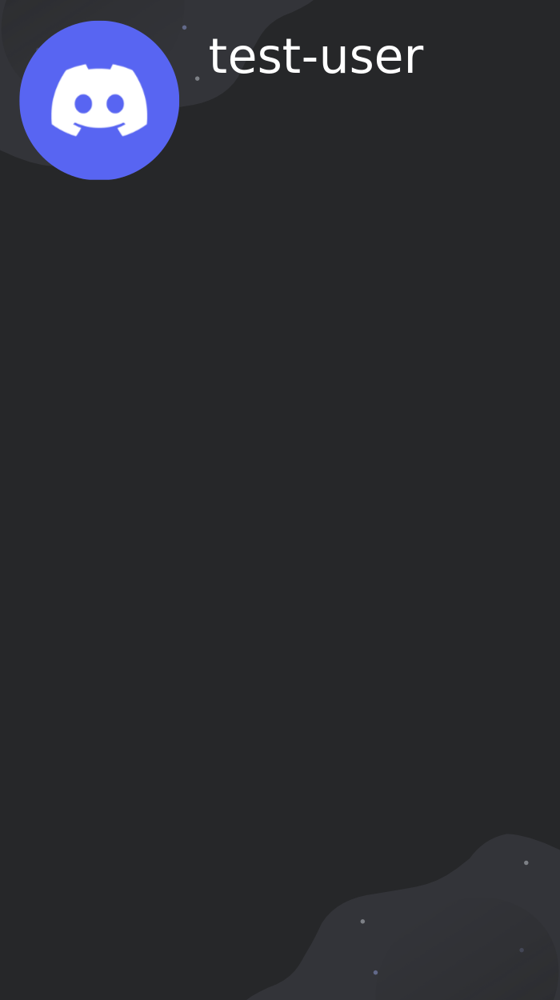

# Paint for Discord
> 🎨 Canvas templates for Discord

<details>
    <summary>📃 Table of Contents</summary>

* [Features](#features)
* [Installation](#installation)
* [Examples](#examples)
* [Changelog](#changelog)
</details>

## Features
- 🎨 Canvas only, no third-party libraries
- 📦 Easy to install & use
- 📝 Multilingual
## Installation

```bash
npm install paintfordiscord
```
or
```bash
yarn add paintfordiscord
```

## Examples

### Leaderboard


```js
const paintfordiscord = require('paintfordiscord');

const img = await paintfordiscord.generateLeaderboard([{
    username: 'test-user',
    score: 100
}]);
```

## Roadmap

- 📦 In progress - Add multilanguage support
- ❎ Add more templates
- ✅ Move functions into `utils/util.ts`
- ✅ Add more customization

## Changelog
> **Note**
> Format: fixes -> additions -> updates -> removals

### 6/19/2022
* WIP - Add multilingual support
* Add Github workflow
* Update README.md
* Update tests
* Update `tsconfig.json`
* Update tests to have 5 users
